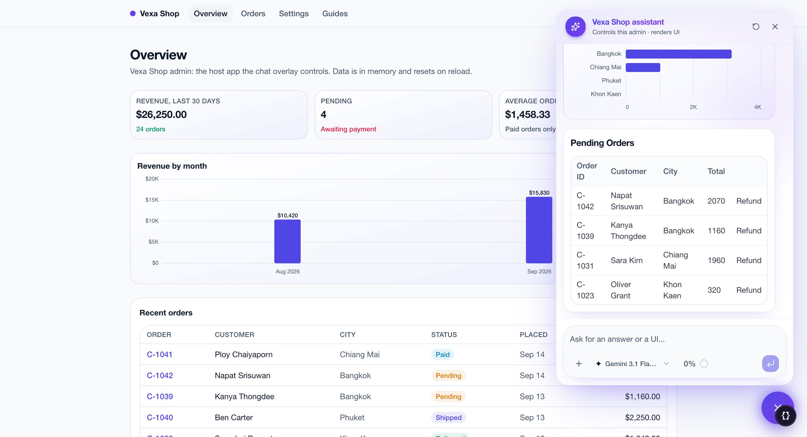
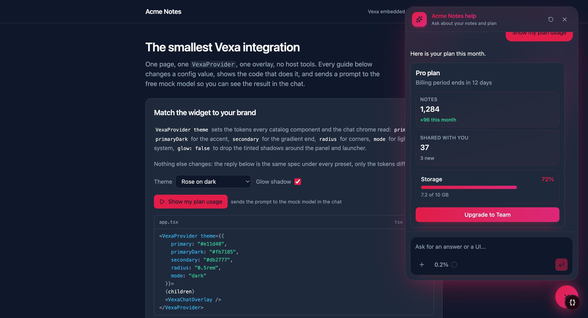

<p align="center">
  
</p>

<p align="center">
  A chat overlay for any React app that answers with text <em>and</em> UI.<br>
  The model composes cards, metrics, tables, charts and forms from a catalog you control, and can drive the page it lives on.
</p>

<p align="center">
  <a href="https://github.com/GA-MO/vexa/actions/workflows/pages.yml"></a>
  <a href="https://github.com/GA-MO/vexa/releases/latest"></a>
  
  
  
</p>

<p align="center">
  <a href="https://ga-mo.github.io/vexa/">Docs</a> ·
  <a href="https://ga-mo.github.io/vexa/docs/get-started">Get started</a> ·
  <a href="https://ga-mo.github.io/vexa/docs/examples/starters">Starters</a> ·
  <a href="https://ga-mo.github.io/vexa/shop-admin/guides/">Shop admin demo</a> ·
  <a href="https://ga-mo.github.io/vexa/widget/">Widget demo</a> ·
  <a href="https://ga-mo.github.io/vexa/playground">Playground</a>
</p>

<p align="center">
  
</p>

## What it is

A chatbot in a product usually ends at a paragraph. Vexa lets the assistant answer the way the product itself would: a question about sales comes back as metric tiles and a chart, an order lookup as a card with a timeline, a booking as a small form that validates and submits. The model does not write React; it emits a JSON spec constrained to a catalog of components, streamed as patches and rendered by [json-render](https://json-render.dev) while it arrives. What is not in the catalog cannot be rendered.

The overlay also acts. Host tools registered on the provider (navigate, filter a table, select a row) run in the browser when the model calls them; buttons inside generated UI call the same tools; mutations can require a confirmation card first. Server tools and MCP servers run behind one handler with tiers, approvals and an injection guard.

Built on the [AI SDK](https://ai-sdk.dev) (`ai` 6) and React 19. The library never imports a model provider or reads an API key: the host passes AI SDK `LanguageModel` instances and owns the prompt layers.

## Features

- **Generative UI from a catalog.** Cards, Metric, Table, Bar and Line charts, Timeline, Form inputs bound to state, Carousel, Map and more. The catalog schema is the source of truth for both the prompt and the renderer.
- **Streamed as patches.** The reply is one text sentence plus JSONL patches that build the spec in place; a follow-up turn patches the previous UI instead of starting over.
- **Host tools.** `defineTool` on `VexaProvider`: the model navigates, reads page state and changes the page; `confirm: true` shows a Run / Cancel card first. Buttons in generated UI run the same tools through `runTool`.
- **Drive the page.** `admin` on the provider and the handler adds three generic tools: `admin_observe` reads the page through its accessibility tree, `admin_run` executes a validated plan of steps (navigate, click, fill, select, submit, read) against the real DOM, and `admin_discover` lets the model look through the app without moving the user; when a click opens the app's own confirmation dialog the run stops and the user decides there (a Vexa card instead with `confirm: "mutating"`). Any accessible control works, no per-screen tool and no data attributes; the app's pages are discovered by themselves in a hidden frame after load and kept per user for a day, every page the user visits is remembered, and nobody has to run or ship anything (an optional `vexa-pages.json` written by the dev server remains for hosts that want the map in git). See [Drive the page](https://ga-mo.github.io/vexa/docs/host/admin).
- **Server tools, MCP, approvals.** `createVexaHandler({ tools, mcp, toolTiers })`: read, write and destructive tiers, approval cards for gated tools, an allow list per MCP server.
- **Injection guard.** Every tool result is fenced as data and scanned; a hit downgrades the turn to read tools and shows a security notice in the chat.
- **Yours to style.** Tokens for colours and radius, light and dark, `theme.glow` for the tinted shadows, `chat.labels` for every string, `format` for locale and currency. Overlay, panel, inline or full page layouts.
- **Free to try.** A scripted mock model (`vexa/mock`) plays every example and guide with no API key, and doubles as a test double for hosts.

## Quick start

Depend on a tagged release from GitHub (the package is not on npm; the lockfile pins the commit, change the tag to upgrade). The package ships TypeScript source, so Next.js needs `transpilePackages: ["vexa"]`; Vite needs nothing.

```json
{
  "dependencies": {
    "vexa": "github:GA-MO/vexa#v0.1.0",
    "ai": "^6.0.84",
    "@ai-sdk/anthropic": "^2.0.0"
  }
}
```

```css
/* app/globals.css */
@import "tailwindcss";
@import "vexa/styles.css";
```

```tsx
// app/providers.tsx
"use client";
import { VexaProvider } from "vexa/react";
import { VexaChatOverlay } from "vexa/chat";

export function Providers({ children }: { children: React.ReactNode }) {
  return (
    <VexaProvider chat={{ title: "Acme assistant" }}>
      {children}
      <VexaChatOverlay />
    </VexaProvider>
  );
}
```

```ts
// app/api/chat/route.ts
import { createAnthropic } from "@ai-sdk/anthropic";
import { createVexaHandler } from "vexa/server";

export const { GET, POST } = createVexaHandler({
  models: () => {
    const anthropic = createAnthropic({ apiKey: process.env.ANTHROPIC_API_KEY });
    return { "claude-sonnet-4": { model: () => anthropic("claude-sonnet-4-20250514"), name: "Claude Sonnet 4", maxTokens: 200_000 } };
  },
});
```

That is the whole integration. [Get started](https://ga-mo.github.io/vexa/docs/get-started) walks through it; [`examples/starter-next`](examples/starter-next) and [`examples/starter-vite`](examples/starter-vite) are the same files as folders, running against the free mock until you add a key. Every release also carries a tarball for hosts that cannot clone: `"vexa": "https://github.com/GA-MO/vexa/releases/download/v0.1.0/vexa-0.1.0.tgz"`.

## Examples

Both apps are hosted with the docs as static, mock-only builds: every guide plays in the browser, no server, no key.

| | What it shows | Open |
|---|---|---|
| **Shop admin** (Next.js) | An internal admin the chat controls: 24 guides on navigation, page state, approvals, server tools, MCP and generated UI that acts | [guides](https://ga-mo.github.io/vexa/shop-admin/guides/) · [source](examples/shop-admin) |
| **Embedded widget** (Vite) | The smallest integration: theme presets, labels in another language, launcher position, overlay / panel / inline / full page | [demo](https://ga-mo.github.io/vexa/widget/) · [source](examples/embedded-widget) |
| **Starters** | The Get started page as a folder, for Next.js and for Vite with a `Bun.serve` chat route | [docs](https://ga-mo.github.io/vexa/docs/examples/starters) · [next](examples/starter-next) · [vite](examples/starter-vite) |

<p align="center">
  
</p>

## How it works

```
  browser                                      server
  ───────                                      ──────
  VexaProvider ── POST /api/chat ───────────▶  createVexaHandler
    │  host tools, page context, model id        │  persona → catalog rules → operational rules → host text → invariants
    │                                            │  server tools · MCP · tiers · approvals · guard
    ◀── text + JSONL spec patches (UI stream) ───┘  streamText + pipeJsonRender
    │
  json-render ▶ catalog components ▶ runTool → host tool → result back to the model
```

- **Catalog** (`src/core/catalog.ts`): one zod schema per component and action. It generates the prompt and validates every patch.
- **Prompt layers** (`src/core/prompt.ts`): persona, catalog rules, operational rules, host instructions, fenced page context, then the library invariants, always last.
- **Runtime** (`src/react`): the registry of components, state namespaces (`/tools/*` and `/host/*` are reserved), `$computed` functions, spec actions `submitForm`, `toast`, `runTool`.
- **Chat** (`src/chat`): the overlay and panel, reasoning and tool calls collapsed into one steps block, approval cards, checkpoints, the composer with attachments and a token meter.

## Entry points

| Import | Contents | Where it runs |
|---|---|---|
| `vexa/react` | `VexaProvider`, `defineTool`, `useVexaHost`, `SpecView`, theme and format | browser |
| `vexa/chat` | `VexaChat`, `VexaChatOverlay`, labels and layout options | browser |
| `vexa/server` | `createVexaHandler`, `connectMcp`, guard rules | server only |
| `vexa/core` | catalog, prompt assembly, spec validation | both |
| `vexa/mock` | `createScriptedModel`, `serveChatInBrowser` for tests and demos | both |
| `vexa/admin` | step schema, error codes, `createAdminTools` for tests; the provider wires it with `admin` | browser |
| `vexa/styles.css` | the token declarations, light defaults and the dark palette | import once |

## Working on the library

Needs [Bun](https://bun.sh) 1.4 or newer. One workspace: the library at the root, the example apps under `examples/`, the docs site under `website/`.

```sh
git clone https://github.com/GA-MO/vexa && cd vexa
bun install
bun run dev                # shop admin on :3001, guides at /guides
bun run dev:widget         # embedded widget on :3003
bun run dev:starter-next   # Next.js starter on :3004
bun run dev:starter-vite   # Vite starter on :3005
bun run dev:site           # docs on :3002
bun run typecheck          # the library, every example and the website
bun run test:scenarios     # the guides as headless scenarios (VEXA_SCENARIO_MODEL=mock for the script)
bun run build:pages        # the static docs + examples that GitHub Pages serves
```

The shop admin lists the models of every provider whose key is in `examples/shop-admin/.env.local` next to the mock (`QWEN_API_KEY` first, then `DEEPSEEK_API_KEY`, `GOOGLE_GENERATIVE_AI_API_KEY`, `GROQ_API_KEY`, `ANTHROPIC_API_KEY`, `OPENROUTER_API_KEY`); the docs site's playground and assistant read `QWEN_API_KEY` (DeepSeek V4 Flash, the default) and `OPENROUTER_API_KEY` from `website/.env.local`; the starters use `ANTHROPIC_API_KEY`. The library itself reads no environment variable.

```
src/
  core/        catalog, prompt, chat stream, handler, MCP, guard
  react/       components, registry, runtime, VexaProvider, theme
  chat/        VexaChat, VexaChatOverlay, messages, composer
  ai-elements/ chat chrome (AI Elements)
  mock/        the scripted mock model and the in-browser chat shim
  examples/    example specs shared by the apps and the docs
mcp/           an MCP server that exposes render_ui
examples/      shop-admin, embedded-widget, starter-next, starter-vite
website/       the docs site (React Router + fumadocs)
docs/          design docs: host-integration-spec, examples-plan, release
```

## Releasing

`bun run release 0.2.0` on a clean `main`: it bumps the version, rewrites the install snippets, tags and pushes; a workflow packs `src/` and publishes the GitHub Release with the tarball. Details in [docs/release.md](docs/release.md).

## Design docs

- [docs/host-integration-spec.md](docs/host-integration-spec.md): how the overlay controls the host and reaches server tools and MCP. Read it before touching `src/chat`, `src/react/runtime.ts` or `src/core`.
- [docs/examples-plan.md](docs/examples-plan.md): the example apps, the scripted mock model and the playable guides.
- [docs/docs-site-plan.md](docs/docs-site-plan.md): the documentation site.
- [DESIGN.md](DESIGN.md): visual tokens and styling rules.
